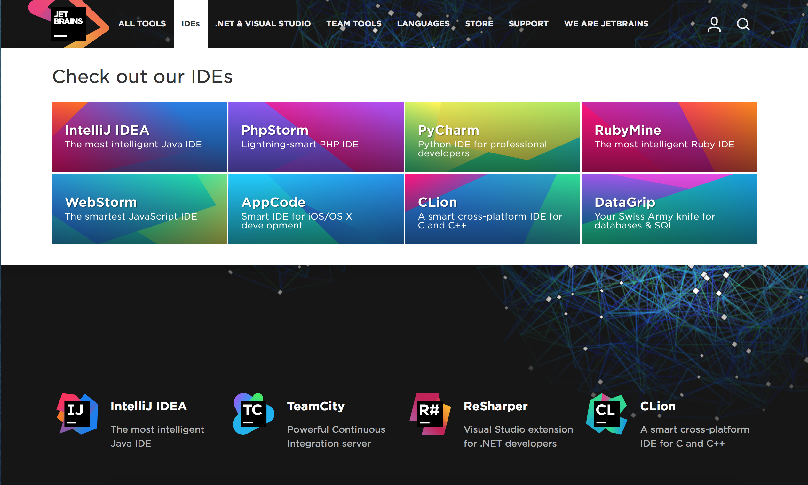
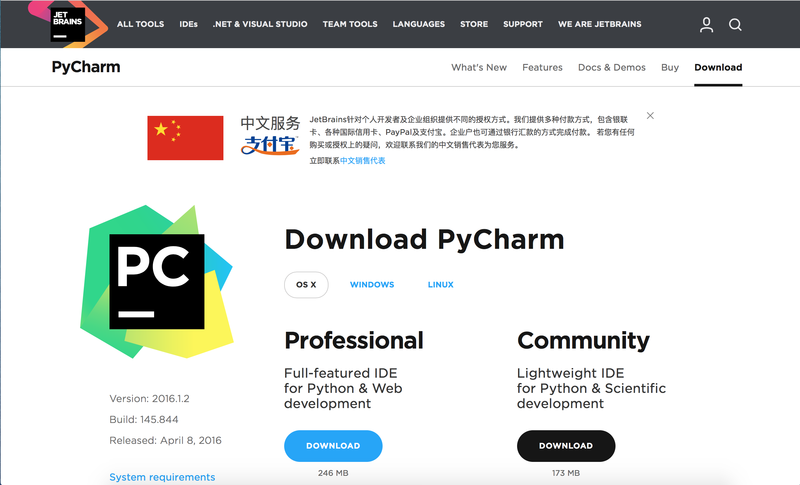
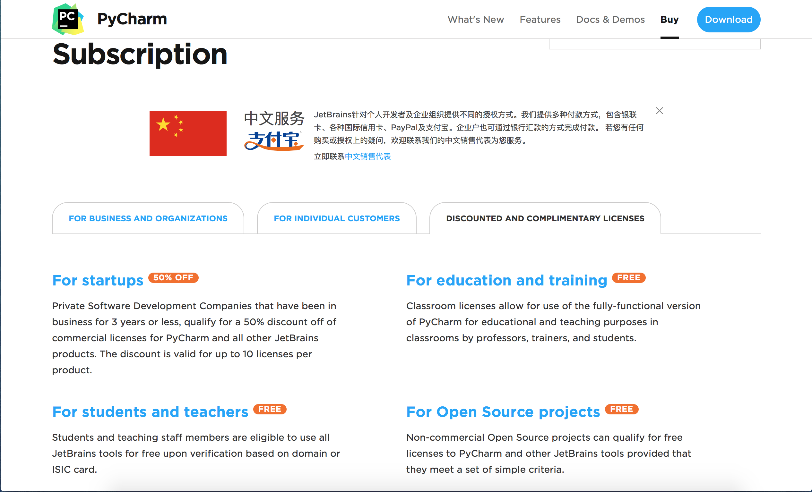
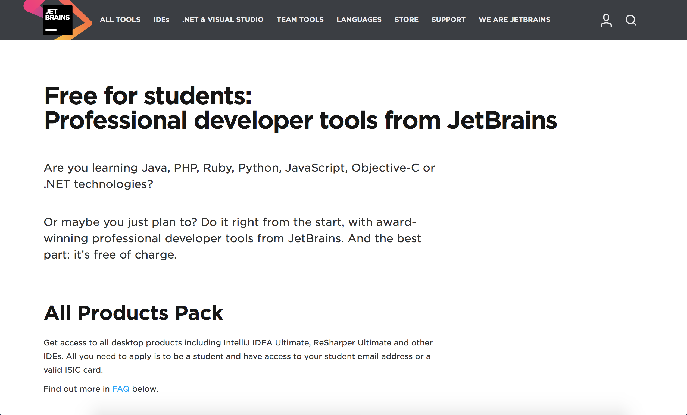
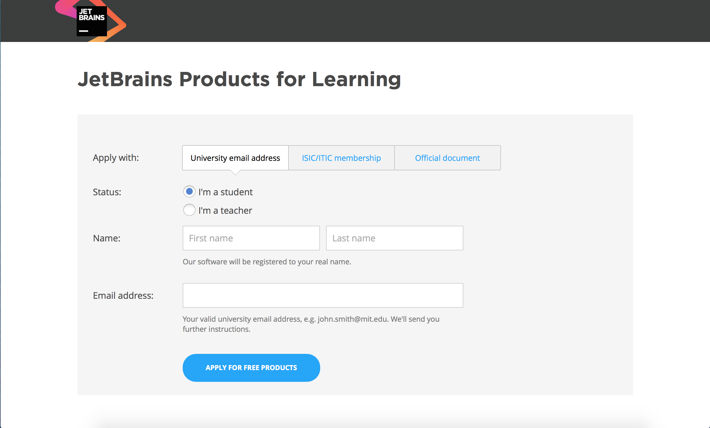
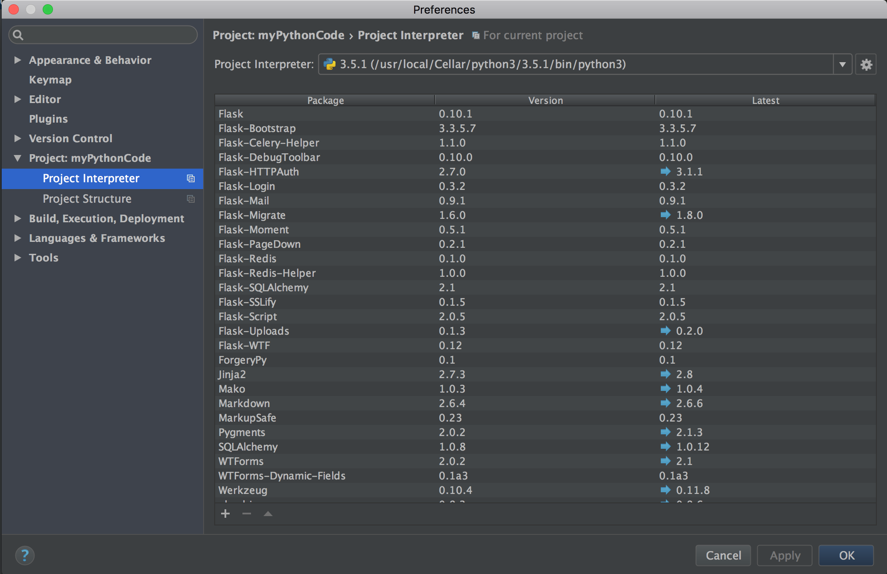
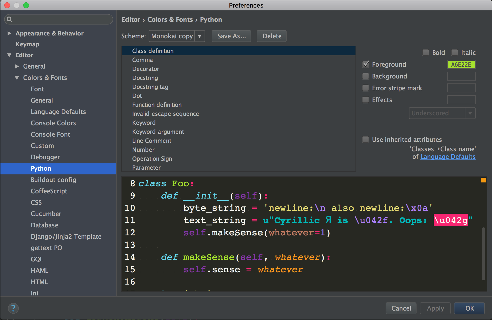

#Python Debug Guide
###### JasonGUTU, Computer @nd Comity ######
###### 香港中文大学（深圳） 计算机协会 编写

##1. Install PyCharm#
市面上提供的 Python debug 工具种类很多，为方便大家学习，此处提供一种较为方便的 python 集成开发环境：PyCharm。 PyCharm 由捷克 IDE 开发商 jetbrains 开发， PyCharm 带有一整套可以帮助用户在使用Python语言开发时提高其效率的工具，比如调试、语法高亮、Project管理、代码跳转、智能提示、自动完成、单元测试、版本控制。此外，该IDE提供了一些高级功能，以用于支持专业Web开发。 PyCharm 是收费软件，但在读大学生可凭 .edu 后缀的教育邮箱获得教育免费。 本文第一部分就来带大家在自己的电脑上安装 PyCharm。

###1. 注册 jetbrains 账号
- 打开 [jetbrains 的官方网站](http://www.jetbrains.com/)
左上角小人型的图标点击注册一个账号，为避免不必要的麻烦，建议使用学校邮箱进行注册，以便申请教育优惠

- 注册好之后进行登陆，==以下均需在登录状况下进行==

###2. 下载 PyCharm
- 选择 IDEs 并打开其中的 PyCharm 选项
- 打开之后先选择 DOWNLOAD NOW 并根据自己的操作系统 下载对应版本的 Professional 版本，然后一边下载一边申请教育优惠

###3. 申请教育优惠。
- 点击右上角的 Buy 按钮， 并选择第三个标签: [DISCOUNTED AND COMPLIMENTARY LICENSE](https://www.jetbrains.com/pycharm/buy/#edition=discounts)。选择 “For students and teachers”。
- 接下来你会看到相应条款，滑倒最下方，有 APPLY 按钮，进入。
- 选择 I'm a student 并填写姓名和邮箱（必须为学校提供的 @link.cuhk.edu.cn 或其他以 .edu 域名结尾的邮箱）。然后回进行两轮邮件认证。最后你会看到 License 激活页面，此时你已经可以免费使用专业版的 PyCharm 了。

###4. 安装 PyCharm
- Mac 用户直接打开下载的文件并拖拽其进入应用程序文件夹即可
- Windows 用户按照他的说明，一直下一步即可
- Linux 用户需确保本机已经安装 JAVA 虚拟环境 jdk（[点此下载](http://www.oracle.com/technetwork/java/javase/downloads/index-jsp-138363.html)），安装好 jdk 后，解压下载的 tar.gz 文件， 进入其目录下的 bin 文件夹并在终端运行 pycharm.sh 这个shell文件，即可启动 PyCharm。你可以把他固定在启动器上一边下次启动。

###5. 进入 PyCharm
打开 PyCharm 后，先选择以前没有使用过 PyCharm，然后在激活页面选择“使用jetbrains账户登录”，输入刚才拿到 License 的帐户和密码。即可激活 PyCharm

###6. 配置你的 PyCharm
- 配置 Python 解释器，打开左上角菜单栏中的设定窗口，找到Project：，打开Project Interpreter 并选择一个解释器（我们用的是 python3，Windows 用户需找到原来的 Python 安装目录下的可执行文件 .exe）
- 配置编辑器字体，大小与颜色，进入设定窗口中的以下选项，**如需更改，需要先把系统默认设定另存为，才能在此基础上进行更改**。

###7. 你现在可以愉快地使用 PyCharm 的强大功能了。

##2. 使用 PyCharm 进行 debug

- 使用 PyCharm 打开你的 Python 工程文件夹，并打开想要 debug 的文件。现在你可以编辑文件，PyCharm 提供非常强大的代码补全、代码查错及高亮，代码风格检查，代码跳转等功能。
- 你可以单击某一行的左侧，在此行设置一个断点
- 然后右键，选择 debug 此文件，文件将会被运行，运行到断点位置时暂停，并在屏幕上显示运到此处时前面所有的变量情况，引用情况。如果想一步步看代码运行情况，可以使用 f8 功能键，一行一行执行代码，直到查出错误。

#### 如需更多帮助，你可以：
#### 1. 加入计算机协会
#### 2. 咨询计算机协会技术人员

